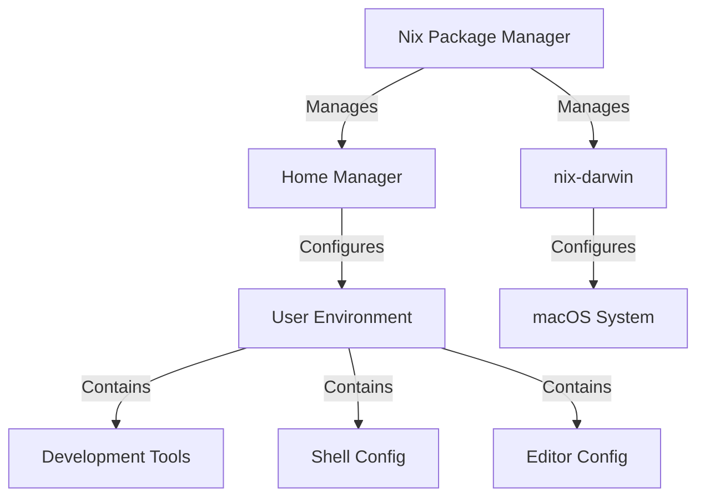
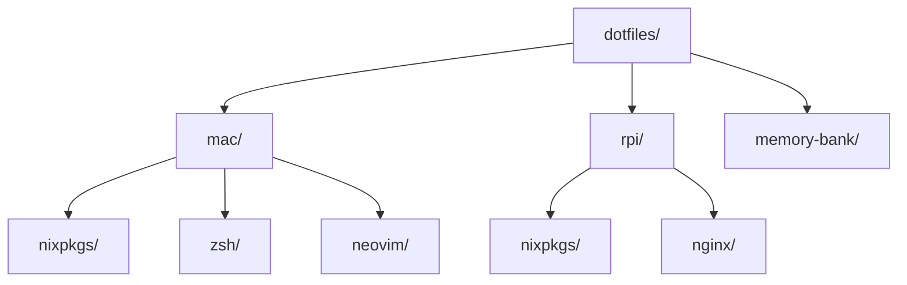

# System Patterns

## Architecture Overview

## Directory Structure

## Core Design Patterns

### 1. Environment Separation
- Clear separation between macOS and Raspberry Pi configurations
- Environment-specific directories with dedicated Nix configurations
- Shared patterns but separate implementations

### 2. Configuration Management
- Declarative configuration using Nix
- Version controlled configuration files
- Modular organization by function (shell, editor, etc.)
- Centralized package management

### 3. Shell Environment
- ZSH as primary shell
- Custom aliases and functions
- Integrated development tools
- Enhanced command-line experience

### 4. Development Tools
- Neovim as primary editor
- Git configuration with SSH signing
- Development utilities (fzf, direnv, etc.)
- Language-specific tooling

## Implementation Patterns

### Nix Configuration
- Flake-based architecture
- Clear separation of concerns
- Package version management
- System and user configuration separation

### Shell Configuration
- Modular ZSH configuration
- Environment variable management
- Tool integration (starship, fzf, etc.)
- Custom alias organization

### Tool Integration
- Direct Nix package integration
- Version-controlled configurations
- Automated setup and maintenance
- Cross-platform compatibility

## Key Technical Decisions

### 1. Package Management
- **Decision**: Use Nix as primary package manager
- **Rationale**: Reproducible builds, declarative configuration
- **Impact**: Consistent environment across systems

### 2. Shell Choice
- **Decision**: ZSH with custom configuration
- **Rationale**: Rich features, good compatibility
- **Impact**: Enhanced developer productivity

### 3. Editor Setup
- **Decision**: Neovim as primary editor
- **Rationale**: Lightweight, extensible, terminal-based
- **Impact**: Consistent editing across environments

### 4. Configuration Structure
- **Decision**: Separate mac/ and rpi/ directories
- **Rationale**: Clear separation of concerns
- **Impact**: Easier maintenance and updates

## Evolution Strategy
1. Keep configurations modular
2. Document all major changes
3. Test changes in isolated environments
4. Maintain backward compatibility
5. Regular updates and maintenance
